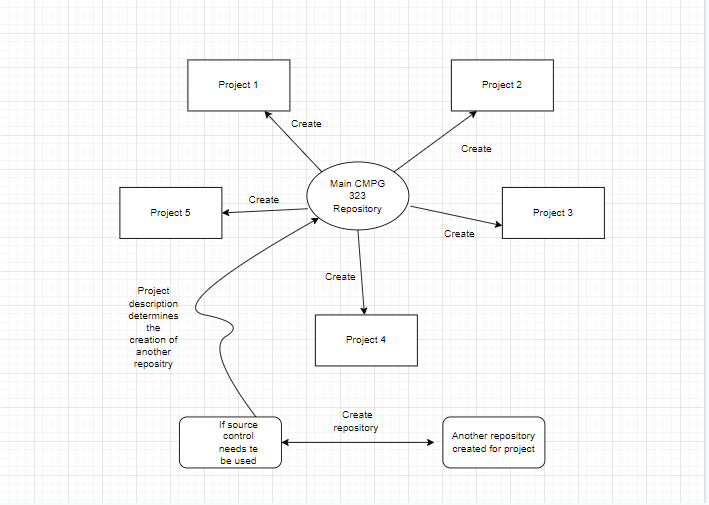

# CMPG-323-Overview---32377630

<h2> Here I adress which repositories will be created and used for each project</h2>
<body> The way I will approach creating repositories and prjoects is by creating a single 
  repositorie and adding each project to that repositorie/kanban as the semester continues.</body>
<h3> Context diagram of explaining project and repository context and how they are integrated 

</h3>
